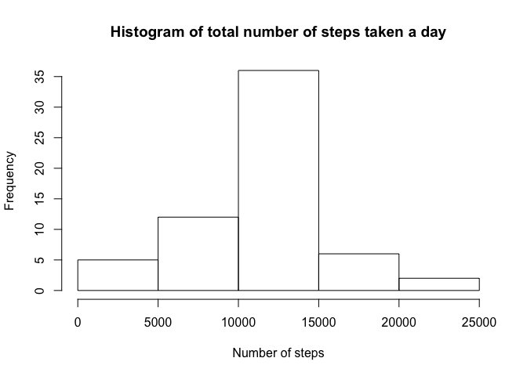

# Reproducible Research: Peer Assessment 1


## Loading and preprocessing the data

```r
library(dplyr)
```

```
## 
## Attaching package: 'dplyr'
```

```
## The following objects are masked from 'package:stats':
## 
##     filter, lag
```

```
## The following objects are masked from 'package:base':
## 
##     intersect, setdiff, setequal, union
```

```r
library(ggplot2)
activity <- read.csv("activity.csv", header = TRUE)
activity$date<- as.Date(activity$date) 
activity_day <- group_by(activity, date)
```

## What is mean total number of steps taken per day?

```r
sum_activity_day <-summarise(activity_day, steps = sum(steps))
hist(sum_activity_day$steps, main = "Histogram of total steps per day", xlab = "Number of steps per day")
```

<!-- -->

```r
mean(sum_activity_day$steps, na.rm = TRUE)
```

```
## [1] 10766.19
```

```r
median(sum_activity_day$steps, na.rm = TRUE)
```

```
## [1] 10765
```

## What is the average daily activity pattern?

```r
activity_interval <- group_by(activity, interval)
sum_activity_interval <- summarise(activity_interval, steps = sum(steps,  na.rm = TRUE))
 plot(sum_activity_interval$interval, sum_activity_interval$steps, type = "l", xlab = "Interval", ylab= "Number of steps", main = "Average number of steps taken throughout the day")
```

<!-- -->

```r
max(activity_interval$steps, na.rm = TRUE)
```

```
## [1] 806
```

## Imputing missing values

```r
sum(is.na(activity$steps))
```

```
## [1] 2304
```

```r
mean_activity_interval <- summarise(activity_interval, steps = mean(steps, na.rm = TRUE))
activity[is.na(activity)] <- mean_activity_interval$steps
```
The NA values have been replaced with the mean of the steps per interval


```r
new_activity_day <- group_by(activity, date)
new_sum_activity_day <-summarise(new_activity_day, steps = sum(steps))
hist(new_sum_activity_day$steps, main= "Histogram of total number of steps taken a day", xlab ="Number of steps")
```

<!-- -->

```r
mean(new_sum_activity_day$steps, na.rm = TRUE)
```

```
## [1] 10766.19
```

```r
median(new_sum_activity_day$steps, na.rm = TRUE)
```

```
## [1] 10766.19
```

## Are there differences in activity patterns between weekdays and weekends?


```r
activity2 <- activity%>%
         mutate(weektype= ifelse(weekdays(activity$date)=="Saturday" | weekdays(activity$date)=="Sunday", "Weekend", "Weekday"))
 activity_weekday <- group_by(activity2, interval, weektype)
 sum_activity_weekday <-  summarise(activity_weekday, steps = mean(steps, na.rm=TRUE))
ggplot(sum_activity_weekday, aes(x =interval , y=steps, color=weektype)) +      geom_line() +  labs(title = "Avg. Daily Steps by Weektype", x = "Interval", y = "No. of Steps")+facet_wrap(~weektype, ncol = 1, nrow=2)
```

<!-- -->
